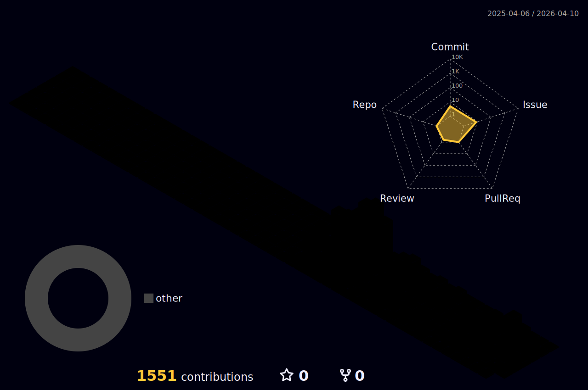

# Hi there, I'm Serral 👋

## 🚀 Senior Software Engineer

I'm a passionate software engineer specializing in cutting-edge technologies including **Artificial Intelligence**, **Blockchain**, and **iGaming** development.

### 💼 About Me

- 🔭 Senior Software Engineer with expertise in AI, Blockchain, and iGaming
- 🌱 Constantly learning and exploring new technologies
- 💡 Building innovative solutions at the intersection of AI and Web3
- 🎮 Creating next-generation gaming experiences

### 🛠️ Tech Stack & Expertise

#### Artificial Intelligence

- Machine Learning & Deep Learning
- Natural Language Processing
- Computer Vision
- AI Model Development & Deployment

#### Blockchain

- Smart Contract Development
- DeFi Protocols
- Web3 Integration
- Cryptocurrency & Token Economics

#### iGaming

- Game Development
- Gaming Platform Architecture
- Real-time Systems
- Payment Integration

## 🔧 Languages & Technologies

### Languages

### AI/ML Stack

### Blockchain

### Backend & Databases

### Frontend

### DevOps & Cloud

### Gaming & Real-time

### 🤝 Connect With Me

### 📈 Profile Views

---

⭐️ From [serral-oss](https://github.com/serral-oss)

### 📈 **GitHub Analytics**

